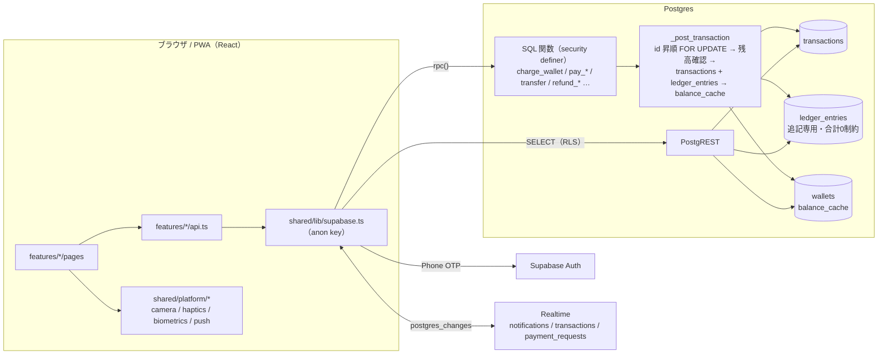

# Any Pay — QRコード決済アプリ（ポートフォリオ / PWA）

PayPay / d払い に相当する QR コード決済アプリを、Web アプリ（PWA）として実装したポートフォリオです。
見た目よりも **「お金を扱うシステムを正しく設計・実装できること」** を示すことを目的にしています。

- 二重記帳の台帳（`ledger_entries`）と、取引ごとの合計 0 を DB 制約で担保
- 残高更新は SQL 関数（RPC）内でのみ。id 昇順の行ロック、冪等キー、レート制限
- RLS による行レベルのアクセス制御。クライアントは金銭系テーブルに書き込めない
- ワンタイム QR（60 秒・1 回限り）、動的 QR（5 分）、静的 QR（印刷）
- サーバー側の PIN ゲート、クーポンの補填仕訳、返金の逆仕訳、台帳の突合

> **実際のお金は一切動きません。** 残高はすべて架空で、資金決済法・犯罪収益移転防止法などの要件は対象外です。

## デモ

| | |
|---|---|
| URL | https://any-pay.pages.dev （Cloudflare Pages。環境変数設定後に有効） |
| ログイン | 電話番号 + 認証コード（Supabase の **Test OTP**。SMS は送られません） |
| デモアカウント | 下表。認証コードはすべて `123456` |

| 電話番号 | ID | 役割 |
|---|---|---|
| `+81 90-0000-0001` | `@alice` | ユーザー（管理者。台帳の突合画面あり） |
| `+81 90-0000-0002` | `@bob` | ユーザー |
| `+81 90-0000-0003` | `@carol` | ユーザー |
| `+81 90-0000-0011` | `@yuki_coffee` | 加盟店「Any Coffee 渋谷店」のオーナー |
| `+81 90-0000-0012` | `@ren_books` | 加盟店「Book & Bean 神保町」のオーナー |

ブラウザを 2 つ開き、片方をユーザー、もう片方を加盟店でログインすると 3 方式すべての決済を試せます。

## 機能一覧

**ユーザー**：電話番号 OTP ログイン / オンボーディング（ID・表示名）/ ホーム（残高・ポイント・直近取引・未読バッジ）/ 支払う（ユーザー提示 QR の自動更新・スキャン）/ 決済確認（店名・金額・クーポン・PIN / 生体認証）/ チャージ（銀行・カード・コンビニ ※UI のみ）/ 送る（ID 検索・受取 QR）/ 受け取る / 割り勘（按分・支払い状況）/ 履歴（月別・種別・取引後残高）/ 明細 / クーポン（獲得・利用）/ ポイント履歴 / 通知（Realtime）/ 設定（プロフィール・PIN・生体認証・出金・店舗登録）

**加盟店**：店舗登録 / 店舗ホーム（本日売上・Realtime で即時反映）/ 決済受付（動的 QR 提示・ユーザー QR 読み取り）/ 決済一覧・明細・返金 / 静的 QR 印刷（A4）/ クーポン作成 / 出金

## 技術スタック

| 層 | 採用 |
|---|---|
| フロント | React 19 + Vite + TypeScript（strict）、React Router v7、TanStack Query、Zustand（UI 状態のみ）、Tailwind CSS v4、lucide-react、react-hook-form + zod |
| PWA | vite-plugin-pwa（manifest / Service Worker / オフラインシェル） |
| QR | 読み取り `BarcodeDetector`（対応環境）→ `@zxing/browser`、生成 `qrcode` |
| バックエンド | Supabase：Auth（Phone OTP）/ Postgres / RLS / RPC（PL/pgSQL, security definer）/ Realtime |
| テスト | Vitest（純粋ロジック）、SQL テスト（RPC・制約・RLS をローカル PostgreSQL で検証）、Playwright（決済フロー 1 本） |
| デプロイ | Cloudflare Pages（フロント）、Supabase Free Tier |

## 構成図



- UI は Supabase を直接 import しない（ESLint で禁止）。`features/<domain>/api.ts` → `shared/lib/supabase.ts` のみが境界
- `window` / `document` の直参照も `shared/platform/` に閉じ込め、Capacitor 化の際にそこだけ差し替える

## 設計判断

### なぜ二重記帳（double-entry）か
`wallets.balance_cache` を直接足し引きするだけでは「どこから来て、どこへ行ったか」が残らず、不整合の検出も再計算もできません。
すべての取引は `ledger_entries` に **借方・貸方の行**（例：ユーザー −1,500 / 加盟店 +1,500）として追記され、`transaction_id` ごとの `sum(amount) = 0` を **遅延制約トリガー** が保証します。チャージ・出金は system wallet（treasury）が相手方になるため、システム全体の台帳合計も常に 0 です。
`balance_cache` は読み取り高速化のためのキャッシュで、`reconcile_wallets()`（管理者）で台帳合計との不一致を検出できます。各行には `balance_after` を持たせ、履歴画面で「取引後残高」を表示します。

### なぜ RPC（SQL 関数）か
残高を変更するコードは `_post_transaction()` ただ一つに集約し、各 RPC（`charge_wallet`, `pay_request`, `transfer`, `refund_transaction` …）はそれを呼ぶだけです。
クライアントは `wallets` / `transactions` / `ledger_entries` / `point_entries` に対して INSERT / UPDATE / DELETE の権限を持たず（`revoke` + RLS）、`security definer` の関数を通じてのみ書き込めます。フロントには金額の加減算ロジックが存在しません。
業務エラーは `raise exception 'INSUFFICIENT_FUNDS'` のようにコードで返し、フロントで日本語に変換します。

### 冪等性
すべての金銭系 RPC は `p_idempotency_key` を受け取ります。
1. `pg_advisory_xact_lock(hashtext(key))` で同一キーの同時呼び出しを直列化
2. 既存の transaction があればそれを返す（二重計上しない）
3. 同じキーで **金額や種別、呼び出しユーザーが異なる** 場合は `IDEMPOTENCY_KEY_CONFLICT` で拒否
4. `transactions.idempotency_key` の UNIQUE 制約が最後の砦

返金は `refund:<元取引 id>` を冪等キーにすることで、クライアントがキーを管理しなくても 1 回しか実行されません。

### ロック順序
関与する wallet を **id 昇順で `SELECT … FOR UPDATE`** してから残高を確認・更新します。A→B と B→A の送金が同時に走ってもロック取得順が同じなのでデッドロックしません。ワンタイムトークンや決済リクエストも `FOR UPDATE` で二重使用を防ぎます。

### ワンタイム QR
`create_qr_token()` は未使用トークンを失効させてから 32 byte の乱数トークンを発行し、60 秒で失効します。加盟店が `pay_with_token()` を呼ぶと期限・未使用を検証して `used_at` を立て、同じトークンは二度と使えません。画面側は残り秒数を表示し、期限前に自動再発行します。決済が完了すると `notifications` の Realtime INSERT を受けてユーザー側が完了画面に切り替わります。

### クーポンの仕訳
店舗クーポンの割引は加盟店負担（ユーザー −1,700 / 加盟店 +1,700）。
全店共通クーポンは **プラットフォームが加盟店に補填** します：ユーザー −2,700 / 加盟店 +3,000 / treasury −300 の 3 行仕訳を同一取引で書き、合計は 0。返金時は逆仕訳で補填分も treasury に戻り、クーポンは復活、ポイントは取り消されます。

### PIN ゲート（サーバー側）
PIN は `crypt()`（bcrypt）でハッシュ保存。5 回失敗で 10 分ロック。PIN 設定済みユーザーの `pay_request` / `pay_static` / `transfer` / `pay_split` は **直近 5 分以内の `verify_pin` 成功** がないと `PIN_REQUIRED` で拒否されます（クライアントの画面を迂回しても決済できません）。
WebAuthn（Face ID / Touch ID）は端末ローカルの再認証ゲートで、**サーバー側の認可には使っていません**。

### 表示用スナップショット
`transactions.metadata` に相手の表示名・店名・割引内訳・決済方式などを記録します。相手の profile は RLS で読めないため、また後で表示名が変わっても履歴が変わらないようにするためです。

## QR ペイロード仕様

| 形式 | 用途 | 読み取った側の処理 |
|---|---|---|
| `ap1:u:<token>` | ユーザー提示（支払い） | 加盟店が金額を入力して `pay_with_token` |
| `ap1:r:<request_id>` | 店舗提示・動的（金額固定） | ユーザーが確認して `pay_request` |
| `ap1:s:<merchant_id>` | 店舗提示・静的（印刷用） | ユーザーが金額入力して `pay_static` |
| `ap1:p:<handle>` | 個人の受取 QR | 送金画面に遷移し `transfer` |

印刷 QR・受取 QR は `https://<host>/scan?d=<payload>` の URL 形式でも発行し、スマホのカメラアプリから直接開けます。解析は `src/features/qr/payload.ts` に集約（zod 検証、単体テストあり）。

## セキュリティ（デモ範囲）と割り切り

| 実装している | 割り切り（デモのため未実装 / 対象外） |
|---|---|
| RLS 全テーブル有効、`anon` キーのみフロントに配置、`service_role` は Edge Functions のみ | KYC（本人確認）、犯収法・資金決済法対応 |
| 金銭系テーブルはクライアント書き込み不可（RPC のみ） | 実際の入出金（銀行・カード・コンビニは UI のみ。Stripe はテストモード） |
| ワンタイム QR 60 秒 / 動的 QR 5 分 / 使用済み即無効 | 出金手数料、送金手数料 |
| 上限：チャージ 100,000 円/回、残高 1,000,000 円、送金 50,000 円/回、決済 20 回/分 | 不正検知、デバイス管理、多要素の本格運用 |
| PIN のサーバー側ハッシュ照合・5 回ロック・決済前ゲート | ポイントでの支払い |
| 台帳合計 0 の DB 制約、追記専用、突合 RPC | Web Push（抽象層のみ。iOS はホーム画面追加時のみ動作） |
| Realtime は本人行・自店行のみ購読 | 監査ログの長期保管、バックアップ運用 |

## 5 分で動かす

1. **Supabase プロジェクトを作成**し、Project Settings → API の URL と anon key を控える
2. **マイグレーションを適用**（どちらか）
   - `supabase login && supabase link --project-ref <ref> && supabase db push`
   - または SQL Editor で `supabase/migrations/0001_*.sql` から順に実行
3. **Authentication → Providers → Phone** を有効化し、**Test OTPs** に上表の電話番号（`819000000001` など）と `123456` を登録（SMS プロバイダ契約は不要）
4. **Database → Replication / Realtime** で `transactions` `notifications` `payment_requests` が publication に含まれていることを確認（マイグレーションで追加済み）
5. （任意）SQL Editor で `supabase/seed.sql` を実行するとデモアカウント・加盟店・クーポン・取引が入る（ローカルなら `supabase db reset` で自動投入）
6. フロントを起動
   ```bash
   cp .env.example .env   # VITE_SUPABASE_URL / VITE_SUPABASE_ANON_KEY を設定
   npm install
   npm run dev            # http://localhost:5173
   ```
7. `/login` で `090-0000-0001` → `123456` でログイン

## テスト

```bash
npm run typecheck && npm run lint && npm run test   # 型・Lint・Vitest（純粋ロジック）
npm run test:sql                                    # SQL テスト（RPC / 制約 / RLS）
npm run test:e2e                                    # Playwright（要 Supabase。E2E_PHONE_USER / E2E_OTP / E2E_MERCHANT_ID）
```

`npm run test:sql` はローカルの PostgreSQL（`initdb` が使える環境）に一時クラスタを立て、Supabase 相当のロール（`anon` / `authenticated`）・`auth.uid()`・default privileges を再現した上で全マイグレーションを適用し、`tests/sql/*.test.sql` を実行します。`DATABASE_URL` を指定すれば `supabase start` の DB でも実行できます。検証している主なもの：

- 他人の wallet / transactions が見えない、クライアントから `wallets` を UPDATE できない、`role` / `pin_hash` を直接更新できない
- 同一 idempotency_key の 2 回呼び出しが 1 取引になる、キーの使い回し（金額違い・他人）は拒否
- 台帳合計 0 違反・`ledger_entries` の UPDATE / DELETE が拒否される
- 残高不足、上限超過、失効 / 使用済み / 期限切れトークン、非オーナーの決済、20 回/分
- 割り勘の検証、返金の逆仕訳、クーポンの補填仕訳、PIN ロックと決済前ゲート、突合

## デプロイ

### Supabase（GitHub Actions で自動反映）

`.github/workflows/supabase.yml` が `supabase/**` の変更を本番プロジェクト（`tyrddhwgiasurpchpkhn`）へ反映します。GitHub リポジトリの **Settings → Secrets and variables → Actions** に次を登録すると有効になります（未登録のときはスキップ）。

| Secret | 取得場所 |
|---|---|
| `SUPABASE_ACCESS_TOKEN` | https://supabase.com/dashboard/account/tokens で「Generate new token」 |
| `SUPABASE_DB_PASSWORD` | プロジェクト作成時の DB パスワード（Project Settings → Database → Reset database password でも可） |
| `STRIPE_SECRET_KEY` / `STRIPE_WEBHOOK_SECRET` | 任意（Stripe テスト決済を使う場合） |

ワークフローがやること：`supabase db push`（マイグレーション）→ `supabase config push`（Phone 認証・Test OTP などの Auth 設定）→ 型生成と手書き `database.ts` の差分を artifact に保存。
**Actions → Supabase deploy → Run workflow** で `seed` にチェックを入れて実行すると `seed.sql`（デモアカウント・加盟店・取引）が投入されます（初回のみ推奨）。`deploy_functions` で Stripe の Edge Functions をデプロイします。

`supabase config push` が Test OTP を反映できなかった場合は、ダッシュボードの **Authentication → Providers → Phone** を有効化し、**Test OTPs** に `819000000001`〜`819000000003`, `819000000011`, `819000000012` を `123456` で手動登録してください。

### Cloudflare Pages

- ダッシュボード：https://dash.cloudflare.com/9724db1aafeaa4cbd55dc98f7c44f9fe/pages/view/any-pay
- Build command: `npm run build` / Build output: `dist` / Node は `.node-version`（22）を参照
- 環境変数（Production / Preview 両方）: `VITE_SUPABASE_URL=https://tyrddhwgiasurpchpkhn.supabase.co`, `VITE_SUPABASE_ANON_KEY=<Project Settings → API の anon public key>`
- Production branch をこのリポジトリの公開ブランチに合わせる（`main` に merge して `main` を指定するのが分かりやすい）
- SPA フォールバックは `public/_redirects`（`/* /index.html 200`）で対応済み。PWA として「ホーム画面に追加」できます
- Supabase 側の **Authentication → URL Configuration** に Pages の URL（`https://any-pay.pages.dev` など）を Site URL として登録

## Stripe テスト決済でチャージ（任意）

Stripe のテストモードで「本物の決済フロー → webhook → 台帳反映」を試せます（実際の請求は発生しません）。

1. Stripe のテスト用 API キーと webhook 署名シークレットを Supabase の secrets に登録
   ```bash
   supabase secrets set STRIPE_SECRET_KEY=sk_test_... STRIPE_WEBHOOK_SECRET=whsec_... APP_ORIGIN=https://<your-app>
   supabase functions deploy stripe-checkout
   supabase functions deploy stripe-webhook --no-verify-jwt   # Stripe からの呼び出しには JWT が付かない
   ```
2. Stripe ダッシュボード → Webhooks に `https://<project-ref>.functions.supabase.co/stripe-webhook` を登録し、イベント `checkout.session.completed` を選択
3. `.env` に `VITE_STRIPE_ENABLED=true` を設定すると、チャージ方法に「カード（Stripe テスト決済）」が現れます。テストカード `4242 4242 4242 4242` で決済すると webhook が `charge_wallet_for()`（`service_role` 専用 RPC）を呼び、Checkout Session id を冪等キーにするため **webhook が再送されても二重計上されません**

## iOS アプリ化の計画（Capacitor）

`shared/platform/` の Web 実装（`camera.ts` = getUserMedia + BarcodeDetector / zxing、`haptics.ts` = `navigator.vibrate`、`biometrics.ts` = WebAuthn、`push.ts` = Web Push、`storage.ts` = localStorage）を、それぞれ `@capacitor-community/barcode-scanner`、`@capacitor/haptics`、`capacitor-native-biometric`、`@capacitor/push-notifications`、`@capacitor/preferences` に差し替えます。ルーティングは history API、環境変数は `shared/lib/env.ts` に集約済みなので、UI 層は変更せずに移行できます。ビルドは GitHub Actions（macOS runner）で行う想定です。

## ディレクトリ構成

```
supabase/migrations/   0001_schema … 0008_stripe（追記のみ）
supabase/functions/    Edge Functions（stripe-checkout / stripe-webhook）
supabase/seed.sql      デモデータ
src/app/               ルーター・Provider・レイアウト・ガード
src/features/          auth / wallet / qr / payment / transfer / history / merchant / rewards / notifications / security / admin
src/shared/ui          汎用コンポーネント
src/shared/lib         supabase クライアント・金額 / 日付整形・エラー変換・冪等キー
src/shared/platform    camera / haptics / biometrics / push / storage（Capacitor 差し替え点）
src/types/database.ts  supabase gen types の出力（db.ts に補助型）
tests/unit             Vitest
tests/sql              SQL テスト（ランナー + Supabase 相当のシム）
tests/e2e              Playwright
```

## 進捗

フェーズごとの完了内容・手動確認手順・既知の課題は [PROGRESS.md](./PROGRESS.md) を参照。
