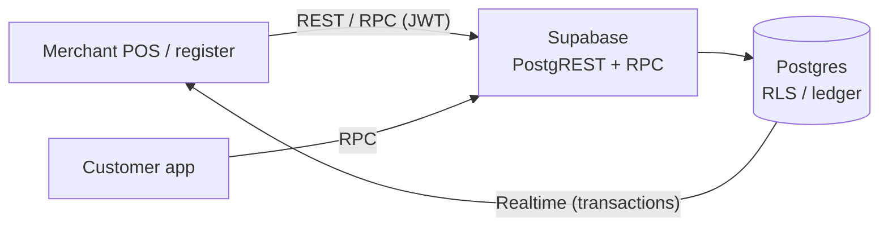
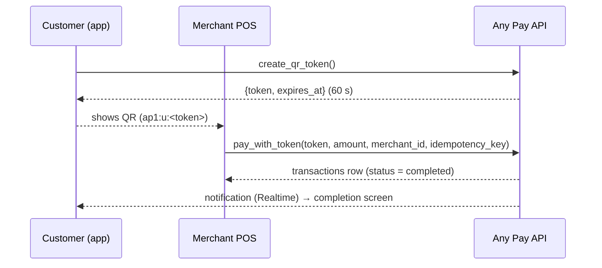
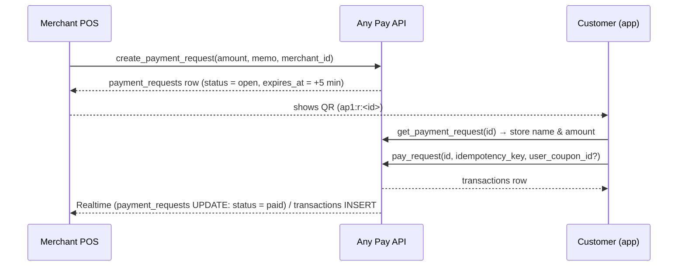

# Any Pay Merchant Integration Specification

Audience: engineers connecting a merchant's POS / register / store system to Any Pay
Version: 1.0 (2026-09) · Applies to: Any Pay (portfolio demo; no real money moves)

---

## 1. Overview

Any Pay is a QR code payment app. Merchants can accept payments in three ways.

| Mode | Who shows the QR | Who sets the amount | Merchant-side work |
|---|---|---|---|
| A. Customer-presented (CPM) | Customer (expires in 60 s, single use) | Merchant | Scan the QR and call `pay_with_token` |
| B. Merchant-presented, dynamic | Merchant (expires in 5 min) | Merchant | Issue a QR with `create_payment_request` and wait for payment |
| C. Merchant-presented, static | Merchant (printed, never expires) | Customer | Just display the QR; confirm via Realtime / the payment list |

All APIs are PostgREST (REST) and RPC (PostgreSQL functions) on Supabase. Calls use the JWT of the merchant owner's account, and row-level security (RLS) restricts every query to the merchant's own data. Balances change only inside server-side functions; clients can never write to money tables directly.



## 2. Endpoints and authentication

| Item | Value |
|---|---|
| Base URL | `https://<project-ref>.supabase.co` |
| REST | `POST /rest/v1/rpc/<function>`, `GET /rest/v1/<table>` |
| Realtime | `wss://<project-ref>.supabase.co/realtime/v1` |
| Required headers | `apikey: <anon key>`, `Authorization: Bearer <user JWT>`, `Content-Type: application/json` |
| Authentication | Supabase Auth (phone number + OTP). The demo uses Test OTPs (e.g. `+819000000011` / `123456`) |

Use the JWT of the user who owns the store. The current version is **one account = one store**; dedicated store API keys are not provided yet (planned: store API keys / terminal registration, see §10).

Recommended client: `@supabase/supabase-js` (RPC, REST and Realtime in one library).

```ts
import { createClient } from '@supabase/supabase-js';
const supabase = createClient(SUPABASE_URL, SUPABASE_ANON_KEY);
await supabase.auth.signInWithOtp({ phone: '+819000000011' });
await supabase.auth.verifyOtp({ phone: '+819000000011', token: '123456', type: 'sms' });
```

## 3. Store registration and store data

| Function | Arguments | Returns | Notes |
|---|---|---|---|
| `register_merchant` | `p_name text, p_category text?, p_address text?` | `merchants` row | One store per account; a second call returns `MERCHANT_ALREADY_REGISTERED` |
| `GET /rest/v1/merchants?owner_id=eq.<uid>` | — | `merchants` row | Retrieve your `id` (`merchant_id`) and `wallet_id` |

`merchants` is public information (readable by every user); only the owner can update it.

```jsonc
// merchants row
{ "id": "44444444-4444-4444-8444-444444444444", "owner_id": "…", "wallet_id": "…",
  "name": "Any Coffee 渋谷店", "category": "Café", "address": "Shibuya, Tokyo", "logo_url": null,
  "created_at": "2026-09-09T00:00:00Z" }
```

## 4. QR payload specification

| Format | Purpose | Reader's action |
|---|---|---|
| `ap1:u:<token>` | Customer-presented | Merchant enters the amount and calls `pay_with_token` |
| `ap1:r:<request_id>` | Merchant-presented, dynamic (fixed amount) | Customer confirms and calls `pay_request` |
| `ap1:s:<merchant_id>` | Merchant-presented, static (printed) | Customer enters the amount and calls `pay_static` |
| `ap1:p:<handle>` | Personal receive QR | Customer sends a transfer |

- `ap1` is the version prefix. The separator is `:`; values never contain `:` or whitespace.
- `token` matches `[A-Za-z0-9_-]{32,64}` (32 random bytes, base64url). `request_id` / `merchant_id` are UUIDs.
- The **URL form** is also valid: `https://<app-host>/scan?d=<URL-encoded payload>`. Use it for printed QRs and launches from the phone camera. Example: `https://any-pay.pages.dev/scan?d=ap1%3As%3A44444444-4444-4444-8444-444444444444`
- When generating QRs yourself, use error-correction level M or higher and at least 0.5 mm per module (5 cm square or larger for an A4 poster).

## 5. Payment flows

### 5.1 A. Customer-presented (merchant scans)



`pay_with_token(p_token text, p_amount bigint, p_merchant_id uuid, p_idempotency_key text) → transactions`

| Check | Error |
|---|---|
| Caller owns `p_merchant_id` | `NOT_MERCHANT_OWNER` |
| Token exists, unused, not expired | `TOKEN_INVALID` / `TOKEN_USED` / `TOKEN_EXPIRED` |
| Amount ≥ ¥1 | `INVALID_AMOUNT` |
| Customer balance | `INSUFFICIENT_FUNDS` (**the token is not consumed**; no need to re-present) |
| Customer rate limit, 20 payments/min | `RATE_LIMITED` |

On success the token is marked used, notifications are created for both parties, and the customer earns 0.5% of the amount (rounded down) in points. Coupons are not applied in this mode.

### 5.2 B. Merchant-presented, dynamic (merchant issues the QR)



| Function | Arguments | Returns / notes |
|---|---|---|
| `create_payment_request` | `p_amount bigint, p_memo text?, p_merchant_id uuid?` | `payment_requests` row. Defaults to the caller's store when `p_merchant_id` is omitted |
| `cancel_payment_request` | `p_request_id uuid` | `open` → `cancelled`; a paid request returns `REQUEST_NOT_OPEN` |
| `GET /rest/v1/payment_requests?id=eq.<id>` | — | Own rows only. `status`: `open` / `paid` / `expired` / `cancelled`; `paid_transaction_id` |

- Requests expire 5 minutes after creation. Paying an expired request returns `REQUEST_EXPIRED`; paying twice returns `REQUEST_NOT_OPEN`.
- `memo` is shown on the customer's confirmation screen (e.g. "2 × caffè latte").
- Detect completion by subscribing to `payment_requests` UPDATEs or `transactions` INSERTs (`merchant_id=eq.<id>`) over Realtime. If you poll instead, use a 2-second interval.

### 5.3 C. Merchant-presented, static (printed QR)

Print and display `ap1:s:<merchant_id>` or its URL form. The customer enters the amount and calls `pay_static`; the merchant confirms via Realtime or the payment list. Because the customer types the amount, verify it at the register.

### 5.4 Amounts when a coupon is applied

In merchant-presented modes (B / C) the customer may select a coupon. `transactions.amount` is the **net amount received after the discount**, and `metadata` carries the breakdown.

| `metadata` key | Meaning |
|---|---|
| `original_amount` | Amount before discount |
| `discount` | Discount amount |
| `coupon_title` / `user_coupon_id` | Applied coupon |
| `subsidy` | For all-store coupons, the amount subsidised by the platform treasury; the merchant receives the full pre-discount amount |

## 6. Transaction data and Realtime

### 6.1 `transactions` (own rows only)

| Column | Meaning |
|---|---|
| `id` | Transaction ID (UUID) |
| `type` | `payment` / `refund` (the types relevant to merchants) |
| `status` | `completed` / `refunded` (original payment after a refund) |
| `amount` | Yen, integer. Amount received for `payment`, amount refunded for `refund` |
| `merchant_id` | Your store ID |
| `memo` | Memo of a dynamic request |
| `idempotency_key` | Caller-supplied key (refunds use `refund:<original id>`) |
| `metadata` | `payment_method` (`user_presented` / `merchant_dynamic` / `merchant_static`), `payer_handle`, `payer_name`, `points`, coupon breakdown, `refund_of` / `refund_transaction_id` |
| `created_at` / `completed_at` | ISO 8601 (UTC) |

Example: `GET /rest/v1/transactions?merchant_id=eq.<id>&type=in.(payment,refund)&order=created_at.desc&limit=100`

### 6.2 `merchant_today_summary(p_merchant_id uuid) → jsonb`

```json
{ "sales": 45600, "count": 23, "refunds": 1500, "refund_count": 1, "net": 44100, "since": "2026-09-08T15:00:00Z" }
```

`since` is midnight Japan time (expressed in UTC). `net = sales - refunds`.

### 6.3 Realtime

```ts
supabase
  .channel(`merchant-tx:${merchantId}:${crypto.randomUUID()}`)   // use a unique channel name per subscription
  .on('postgres_changes',
      { event: 'INSERT', schema: 'public', table: 'transactions', filter: `merchant_id=eq.${merchantId}` },
      (payload) => handle(payload.new))
  .subscribe();
```

RLS applies, so other stores' rows never arrive. After a disconnect, re-fetch the delta over REST once reconnected.

## 7. Refunds

`refund_transaction(p_transaction_id uuid) → transactions`

- Full refunds only (no partial refunds). A reversing `refund` transaction is created and the original becomes `status = refunded`.
- Idempotent: a second call for the same payment returns `ALREADY_REFUNDED`.
- Refunds are paid from the store balance; insufficient balance returns `INSUFFICIENT_FUNDS` (the original payment is unchanged).
- The customer's points are revoked and any coupon used becomes available again. The subsidy of an all-store coupon is returned to the platform.
- Only own transactions with `type = payment` and `status = completed` are refundable (`NOT_REFUNDABLE` / `NOT_MERCHANT_OWNER`).

## 8. Withdrawals and coupons

| Operation | How |
|---|---|
| Withdraw the store balance | `withdraw(p_amount, p_idempotency_key, p_wallet_id = store wallet_id)`. Fee ¥0 (demo). No real transfer is made |
| Create a store coupon | `POST /rest/v1/coupons` (RLS: only when `merchant_id` is your store). `discount_type`: `fixed` / `percent`, `value`, `min_amount`, `valid_until`, `max_uses` |
| Delete a coupon | `DELETE /rest/v1/coupons?id=eq.<id>` (own coupons only) |

## 9. Idempotency, errors and limits

### 9.1 Idempotency

Money-moving functions (`pay_with_token` / `pay_request` / `pay_static` / `withdraw`) take `p_idempotency_key` (8–128 characters). **Resending with the same key returns the same transaction and never double-posts.** On a network error or timeout, retry with the same key. A different amount or another user's key returns `IDEMPOTENCY_KEY_CONFLICT`. Generate one key per payment on the POS (UUID recommended) and keep it until a response arrives.

### 9.2 Error format

RPC failures return HTTP 400 with a JSON body; `message` is the error code.

```json
{ "code": "P0001", "message": "TOKEN_EXPIRED", "details": null, "hint": null }
```

| Code | Meaning | POS action |
|---|---|---|
| `TOKEN_EXPIRED` / `TOKEN_USED` / `TOKEN_INVALID` | Customer QR expired / used / invalid | Ask for a fresh QR |
| `INSUFFICIENT_FUNDS` | Customer balance too low (payment) / store balance too low (refund) | Another payment method / fund the balance |
| `RATE_LIMITED` | Customer exceeded 20 payments per minute | Wait a minute |
| `REQUEST_NOT_OPEN` / `REQUEST_EXPIRED` / `REQUEST_NOT_FOUND` | Dynamic request in a bad state | Issue a new QR |
| `NOT_MERCHANT_OWNER` / `MERCHANT_NOT_FOUND` | Wrong account or `merchant_id` | Check the login and `merchant_id` |
| `ALREADY_REFUNDED` / `NOT_REFUNDABLE` / `TRANSACTION_NOT_FOUND` | Refund target problem | Check the transaction |
| `INVALID_AMOUNT` / `LIMIT_EXCEEDED` / `IDEMPOTENCY_KEY_CONFLICT` / `INVALID_IDEMPOTENCY_KEY` | Input problem | Fix the input |
| `NOT_AUTHENTICATED` | Missing / expired JWT | Sign in again |

### 9.3 Limits

| Item | Value |
|---|---|
| Customer QR validity | 60 seconds, single use |
| Dynamic QR validity | 5 minutes |
| Customer payment rate | 20 per minute |
| Amounts | Yen, integer (`bigint`); no decimals |
| Customer balance cap | ¥1,000,000 |
| memo | 100 characters |
| Points | 0.5% of the paid amount (after discount), rounded down; revoked on refund |

## 10. Security and responsibilities

- All traffic is over TLS. Store the JWT securely on the device and never write it to logs.
- RLS prevents access to other stores' and other users' data. Direct writes to money tables are rejected.
- The ledger is double-entry (each transaction sums to zero) and append-only; it can be reconciled against `transactions`.
- Not implemented in this version: store API keys, terminal registration, partial refunds, multiple stores per account, settlement report APIs.
- This app is a portfolio demo; payment-services and anti-money-laundering regulations are out of scope.

## 11. Integration test procedure (demo environment)

1. Sign in with a merchant-owner test number (e.g. `+819000000011` / `123456`) and read your `merchant_id` from `merchants`.
2. Sign in as a customer with another test number (e.g. `+819000000001`) and fund it with `charge_wallet(10000, 'bank', '<key>')`.
3. Customer calls `create_qr_token()`, merchant calls `pay_with_token`; verify one `payment` row appears in `transactions`. Resend with the same `idempotency_key` and verify the count does not change.
4. Merchant calls `create_payment_request(1200, 'test')`, customer calls `pay_request`; receive `payment_requests.status = paid` over Realtime.
5. Call `refund_transaction`; verify the original becomes `refunded` and one `refund` row exists.

## 12. Change log

| Version | Date | Changes |
|---|---|---|
| 1.0 | 2026-09 | Initial release |
