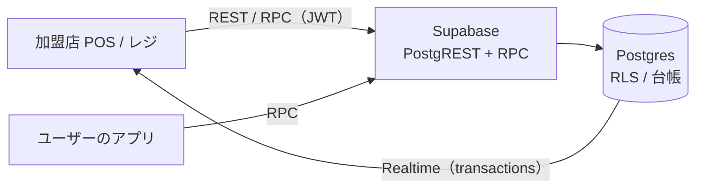
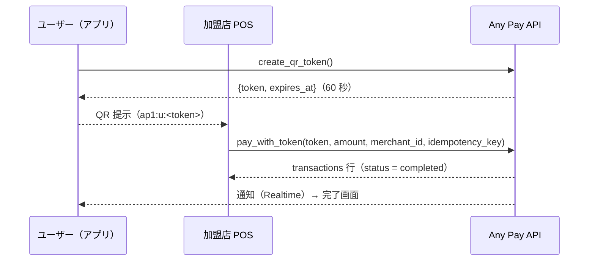
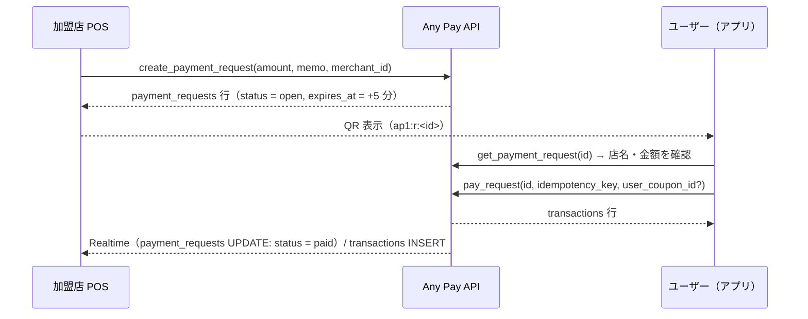

# Any Pay 加盟店向け 連携仕様書

対象：加盟店の POS / レジ / 店舗システムを Any Pay と接続する開発者
版：1.0（2026-09）　対応アプリ：Any Pay（ポートフォリオ用デモ。実際のお金は動きません）

---

## 1. 概要

Any Pay は QR コード決済アプリです。加盟店は次の 3 方式で決済を受け付けられます。

| 方式 | QR を出す側 | 金額を決める側 | 加盟店側の処理 |
|---|---|---|---|
| A. ユーザー提示（CPM） | ユーザー（60 秒で失効、1 回限り） | 加盟店 | QR を読み取り `pay_with_token` を呼ぶ |
| B. 店舗提示・動的（MPM 動的） | 加盟店（5 分で失効） | 加盟店 | `create_payment_request` で QR を発行し、支払いを待つ |
| C. 店舗提示・静的（MPM 静的） | 加盟店（印刷。失効なし） | ユーザー | QR を掲示するだけ。支払いは Realtime / 一覧で確認 |

すべての API は Supabase 上の PostgREST（REST）と RPC（PostgreSQL 関数）です。加盟店オーナーのアカウントで取得した JWT で呼び出し、行レベルセキュリティ（RLS）により自店のデータだけが見えます。残高の変更はすべてサーバー側の関数内で行われ、クライアントから金銭系テーブルを直接書き換えることはできません。



## 2. 接続情報と認証

| 項目 | 値 |
|---|---|
| ベース URL | `https://<project-ref>.supabase.co` |
| REST | `POST /rest/v1/rpc/<関数名>`、`GET /rest/v1/<テーブル>` |
| Realtime | `wss://<project-ref>.supabase.co/realtime/v1` |
| 必須ヘッダ | `apikey: <anon key>`、`Authorization: Bearer <ユーザー JWT>`、`Content-Type: application/json` |
| 認証 | Supabase Auth（電話番号 + OTP）。デモ環境は Test OTP（例：`+819000000011` / `123456`） |

JWT は加盟店オーナーとしてログインしたユーザーのものを使います。現行版では **1 アカウント = 1 店舗** で、店舗専用の API キーは提供していません（将来：店舗 API キー / 端末登録を予定。§10）。

推奨クライアント：`@supabase/supabase-js`（RPC・REST・Realtime を 1 つで扱えます）。

```ts
import { createClient } from '@supabase/supabase-js';
const supabase = createClient(SUPABASE_URL, SUPABASE_ANON_KEY);
await supabase.auth.signInWithOtp({ phone: '+819000000011' });
await supabase.auth.verifyOtp({ phone: '+819000000011', token: '123456', type: 'sms' });
```

## 3. 店舗登録と店舗情報

| 関数 | 引数 | 戻り値 | 備考 |
|---|---|---|---|
| `register_merchant` | `p_name text, p_category text?, p_address text?` | `merchants` 行 | 1 アカウント 1 店舗。2 回目は `MERCHANT_ALREADY_REGISTERED` |
| `GET /rest/v1/merchants?owner_id=eq.<uid>` | — | `merchants` 行 | 自店の `id`（`merchant_id`）と `wallet_id` を取得 |

`merchants` は公開情報（全ユーザーが参照可）です。更新はオーナーのみ。

```jsonc
// merchants 行
{ "id": "44444444-4444-4444-8444-444444444444", "owner_id": "…", "wallet_id": "…",
  "name": "Any Coffee 渋谷店", "category": "カフェ", "address": "東京都渋谷区", "logo_url": null,
  "created_at": "2026-09-09T00:00:00Z" }
```

## 4. QR ペイロード仕様

| 形式 | 用途 | 読み取った側 |
|---|---|---|
| `ap1:u:<token>` | ユーザー提示 | 加盟店：金額を入力し `pay_with_token` |
| `ap1:r:<request_id>` | 店舗提示・動的（金額固定） | ユーザー：確認して `pay_request` |
| `ap1:s:<merchant_id>` | 店舗提示・静的（印刷） | ユーザー：金額入力して `pay_static` |
| `ap1:p:<handle>` | 個人の受取 QR | ユーザー：送金 |

- `ap1` はバージョン接頭辞。区切りは `:`、値に `:` と空白は含みません。
- `token` は `[A-Za-z0-9_-]{32,64}`（32 バイト乱数の base64url）。`request_id` / `merchant_id` は UUID。
- **URL 形式**も有効です：`https://<app-host>/scan?d=<URL エンコードしたペイロード>`。印刷 QR や標準カメラからの起動に使います。例：`https://any-pay.pages.dev/scan?d=ap1%3As%3A44444444-4444-4444-8444-444444444444`
- 加盟店が QR を生成する場合は、誤り訂正レベル M 以上、モジュール 1 つあたり 0.5 mm 以上（A4 掲示なら 5 cm 角以上）を推奨します。

## 5. 決済フロー

### 5.1 A. ユーザー提示（加盟店が読み取る）



`pay_with_token(p_token text, p_amount bigint, p_merchant_id uuid, p_idempotency_key text) → transactions`

| 検証 | エラー |
|---|---|
| 呼び出し元が `p_merchant_id` のオーナー | `NOT_MERCHANT_OWNER` |
| トークンが存在・未使用・期限内 | `TOKEN_INVALID` / `TOKEN_USED` / `TOKEN_EXPIRED` |
| 金額 1 円以上 | `INVALID_AMOUNT` |
| ユーザー残高 | `INSUFFICIENT_FUNDS`（**トークンは消費されません**。再提示不要） |
| ユーザーの決済回数 20 回/分 | `RATE_LIMITED` |

成功時：トークンは使用済みになり、ユーザーと加盟店の双方に通知が作られ、ユーザーには決済額の 0.5%（切り捨て）のポイントが付与されます。この方式ではクーポンは適用されません。

### 5.2 B. 店舗提示・動的（加盟店が QR を発行）



| 関数 | 引数 | 戻り値 / 備考 |
|---|---|---|
| `create_payment_request` | `p_amount bigint, p_memo text?, p_merchant_id uuid?` | `payment_requests` 行。`p_merchant_id` 省略時は呼び出し元の店舗 |
| `cancel_payment_request` | `p_request_id uuid` | `open` → `cancelled`。支払い済みは `REQUEST_NOT_OPEN` |
| `GET /rest/v1/payment_requests?id=eq.<id>` | — | 自店の行のみ参照可。`status`：`open` / `paid` / `expired` / `cancelled`、`paid_transaction_id` |

- 有効期限は発行から 5 分。期限切れの支払いは `REQUEST_EXPIRED`、二重支払いは `REQUEST_NOT_OPEN` で拒否されます。
- `memo` はユーザーの確認画面に表示されます（例：「カフェラテ 2 点」）。
- 支払い完了の検知：Realtime で `payment_requests` の UPDATE、または `transactions` の INSERT（`merchant_id=eq.<id>`）を購読します。ポーリングする場合は 2 秒間隔を推奨します。

### 5.3 C. 店舗提示・静的（印刷 QR）

`ap1:s:<merchant_id>` またはその URL 形式を印刷して掲示します。ユーザーが金額を入力して `pay_static` を呼び、加盟店側は Realtime / 決済一覧で確認します。金額はユーザー入力のため、レジで金額を確認してください。

### 5.4 クーポン適用時の金額

店舗提示型（B / C）ではユーザーがクーポンを選べます。`transactions.amount` は **割引後の実受取額**で、`metadata` に内訳が入ります。

| `metadata` キー | 内容 |
|---|---|
| `original_amount` | 割引前の金額 |
| `discount` | 割引額 |
| `coupon_title` / `user_coupon_id` | 適用クーポン |
| `subsidy` | 全店共通クーポンの場合、運営（treasury）が補填した額。加盟店の受取額は割引前と同額になります |

## 6. 取引データと Realtime

### 6.1 `transactions`（自店の行のみ参照可）

| 列 | 内容 |
|---|---|
| `id` | 取引 ID（UUID） |
| `type` | `payment` / `refund`（加盟店に関係するもの） |
| `status` | `completed` / `refunded`（返金済みの元取引） |
| `amount` | 円・整数。`payment` は受取額、`refund` は返金額 |
| `merchant_id` | 自店の ID |
| `memo` | 動的 QR の memo |
| `idempotency_key` | 呼び出し側が指定したキー（返金は `refund:<元取引 id>`） |
| `metadata` | `payment_method`（`user_presented` / `merchant_dynamic` / `merchant_static`）、`payer_handle`、`payer_name`、`points`、クーポン内訳、`refund_of` / `refund_transaction_id` |
| `created_at` / `completed_at` | ISO 8601（UTC） |

例：`GET /rest/v1/transactions?merchant_id=eq.<id>&type=in.(payment,refund)&order=created_at.desc&limit=100`

### 6.2 `merchant_today_summary(p_merchant_id uuid) → jsonb`

```json
{ "sales": 45600, "count": 23, "refunds": 1500, "refund_count": 1, "net": 44100, "since": "2026-09-08T15:00:00Z" }
```

`since` は日本時間 0 時（UTC 表記）。`net = sales - refunds`。

### 6.3 Realtime

```ts
supabase
  .channel(`merchant-tx:${merchantId}:${crypto.randomUUID()}`)   // チャンネル名は購読ごとに一意にする
  .on('postgres_changes',
      { event: 'INSERT', schema: 'public', table: 'transactions', filter: `merchant_id=eq.${merchantId}` },
      (payload) => handle(payload.new))
  .subscribe();
```

RLS が適用されるため、他店の行は届きません。切断時に備え、再接続後は REST で差分を取り直してください。

## 7. 返金

`refund_transaction(p_transaction_id uuid) → transactions`

- 全額返金のみ（部分返金は非対応）。逆仕訳の `refund` 取引が作られ、元取引は `status = refunded` になります。
- 冪等：同じ取引に対する 2 回目は `ALREADY_REFUNDED`。
- 店舗残高から返金するため、残高不足は `INSUFFICIENT_FUNDS`（元取引は変わりません）。
- ユーザーのポイントは取り消され、使用クーポンは復活します。全店共通クーポンの補填分は運営に戻ります。
- 返金できるのは `type = payment` かつ `status = completed` の自店取引のみ（`NOT_REFUNDABLE` / `NOT_MERCHANT_OWNER`）。

## 8. 出金・クーポン

| 操作 | 方法 |
|---|---|
| 店舗残高の出金 | `withdraw(p_amount, p_idempotency_key, p_wallet_id = 店舗の wallet_id)`。手数料 0（デモ）。実際の振込は行われません |
| 店舗クーポンの作成 | `POST /rest/v1/coupons`（RLS：`merchant_id` が自店のときのみ）。`discount_type`：`fixed` / `percent`、`value`、`min_amount`、`valid_until`、`max_uses` |
| クーポンの削除 | `DELETE /rest/v1/coupons?id=eq.<id>`（自店のみ） |

## 9. 冪等性・エラー・制限

### 9.1 冪等性

金銭系の関数（`pay_with_token` / `pay_request` / `pay_static` / `withdraw`）は `p_idempotency_key`（8〜128 文字）を受け取ります。**同じキーで再送すると同じ取引を返し、二重計上されません。** 通信断やタイムアウト時は同じキーで再送してください。異なる金額や他人のキーは `IDEMPOTENCY_KEY_CONFLICT` になります。キーは POS 側で 1 決済ごとに生成し（UUID 推奨）、応答が得られるまで保持してください。

### 9.2 エラー形式

RPC の失敗は HTTP 400 と JSON で返ります。`message` がエラーコードです。

```json
{ "code": "P0001", "message": "TOKEN_EXPIRED", "details": null, "hint": null }
```

| コード | 意味 | POS の対処 |
|---|---|---|
| `TOKEN_EXPIRED` / `TOKEN_USED` / `TOKEN_INVALID` | ユーザー QR の期限切れ / 使用済み / 不正 | 新しい QR を提示してもらう |
| `INSUFFICIENT_FUNDS` | ユーザー残高不足（決済） / 店舗残高不足（返金） | 別の支払い方法 / 残高確保 |
| `RATE_LIMITED` | ユーザーの決済が 20 回/分を超過 | 1 分待つ |
| `REQUEST_NOT_OPEN` / `REQUEST_EXPIRED` / `REQUEST_NOT_FOUND` | 動的 QR の状態異常 | QR を再発行 |
| `NOT_MERCHANT_OWNER` / `MERCHANT_NOT_FOUND` | 権限・店舗 ID の誤り | ログインアカウント / `merchant_id` を確認 |
| `ALREADY_REFUNDED` / `NOT_REFUNDABLE` / `TRANSACTION_NOT_FOUND` | 返金対象の異常 | 取引を確認 |
| `INVALID_AMOUNT` / `LIMIT_EXCEEDED` / `IDEMPOTENCY_KEY_CONFLICT` / `INVALID_IDEMPOTENCY_KEY` | 入力異常 | 入力を修正 |
| `NOT_AUTHENTICATED` | JWT なし / 失効 | 再ログイン |

### 9.3 制限値

| 項目 | 値 |
|---|---|
| ユーザー QR の有効期限 | 60 秒・1 回限り |
| 動的 QR の有効期限 | 5 分 |
| ユーザーの決済回数 | 20 回/分 |
| 金額 | 円・整数（`bigint`）。小数なし |
| 残高上限（ユーザー） | 1,000,000 円 |
| memo | 100 文字 |
| ポイント | 決済額（割引後）の 0.5%、切り捨て。返金で取消 |

## 10. セキュリティと責任分界

- 通信は TLS。JWT は端末内に安全に保管し、ログに出力しないでください。
- RLS により他店・他ユーザーのデータは参照できません。金銭系テーブルへの直接書き込みは拒否されます。
- 台帳は二重記帳（取引ごとの合計 0）・追記専用で、`transactions` と突合できます。
- 現行版の割り切り：店舗 API キー・端末登録・部分返金・複数店舗・精算レポート API は未実装です。
- 本アプリはポートフォリオ用デモであり、資金決済法・犯罪収益移転防止法等の要件は対象外です。

## 11. 接続テスト手順（デモ環境）

1. 加盟店オーナーのテスト番号（例：`+819000000011` / `123456`）でログインし、`merchants` から `merchant_id` を取得する。
2. 別のテスト番号（例：`+819000000001`）でユーザーとしてログインし、`charge_wallet(10000, 'bank', '<key>')` で残高を用意する。
3. ユーザーが `create_qr_token()` → 加盟店が `pay_with_token` を呼び、`transactions` に `payment` が 1 件できることを確認する。同じ `idempotency_key` で再送し、件数が増えないことを確認する。
4. 加盟店が `create_payment_request(1200, 'テスト')` → ユーザーが `pay_request` → `payment_requests.status = paid` を Realtime で受信する。
5. `refund_transaction` で返金し、元取引が `refunded`、`refund` 取引が 1 件できることを確認する。

## 12. 変更履歴

| 版 | 日付 | 内容 |
|---|---|---|
| 1.0 | 2026-09 | 初版 |
