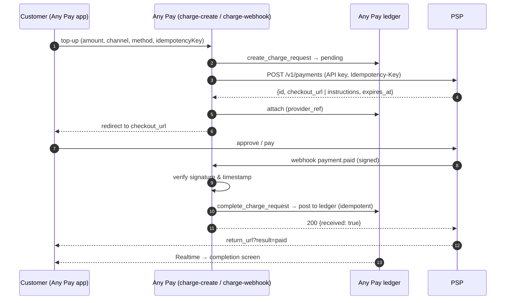
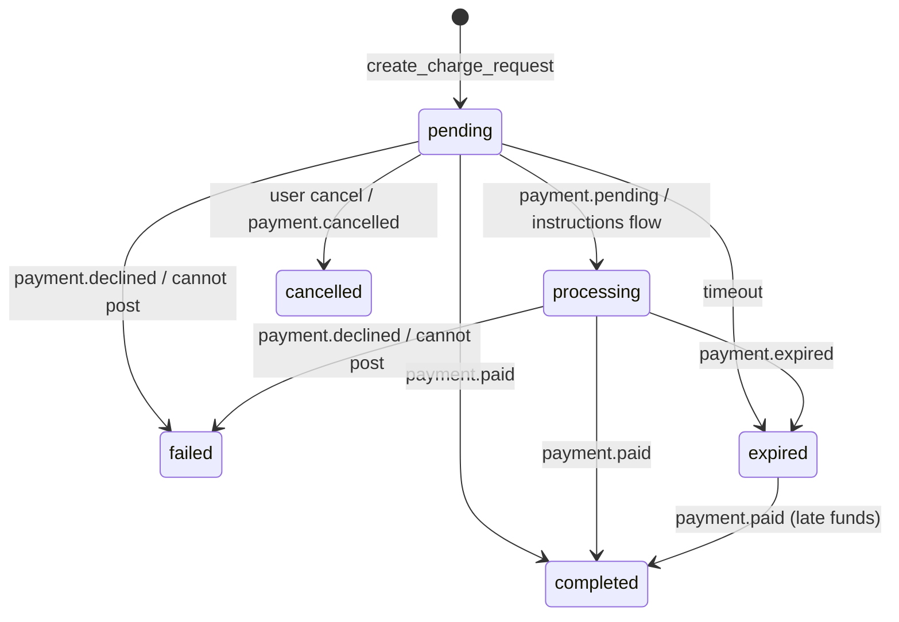

# Any Pay Payment Provider Integration Specification (Balance Top-ups)

Audience: engineers at payment service providers (PSPs) offering Any Pay balance top-ups via credit card, bank connectivity (direct debit / bank transfer) or other electronic payments (convenience store, e-money, wallets)
Version: 1.0 (2026-09) · Applies to: Any Pay (portfolio demo; no real money moves)

---

## 1. Overview

Balance top-ups in Any Pay are handled by the **Charge Gateway**, a provider-agnostic implementation of the flow "top-up request → approval at the provider → signed webhook → ledger posting". A PSP only needs to provide two things:

1. **A payment-creation API**: given an amount and return URL, respond with the URL of an approval page (or payment instructions such as a payment code)
2. **A confirmation webhook**: once the outcome is final, notify Any Pay with a signed request

On the Any Pay side the connection is a "provider adapter" (§8). The bundled **sandbox** (`sandbox-gateway`) is the reference implementation of the PSP-side API; if your API satisfies the same contract, the adapter can be reused almost as is.



## 2. Terms and channels

| Term | Meaning |
|---|---|
| Channel (`channel`) | `bank` (bank connectivity) / `card` (credit card) / `emoney` (other electronic payments) |
| Method (`method`) | A concrete means within a channel: `bank_debit`, `bank_transfer`, `card`, `konbini`, `wallet`, `paypay`, … Lowercase letters, digits and `_`, 2–32 characters |
| Flow (`flow`) | `redirect` (completes on an approval page) / `instructions` (shows a payment code etc.; funds arrive later) |
| Top-up request | A `charge_requests` row on the Any Pay side, one-to-one with a PSP payment |
| `provider_ref` | The PSP's payment ID |
| `reference` | The Any Pay top-up request ID (UUID). The PSP stores it and must echo it in webhooks |

### Channel-specific requirements

| Channel | Expected flow | What the PSP must handle |
|---|---|---|
| Credit card | `redirect`. Card entry (or stored card) → authorisation + immediate capture (single step) | Declines are `payment.declined`. 3-D Secure is completed on the PSP side. If you authorise first and capture later, send `payment.pending` (§5.3) and confirm afterwards |
| Bank connectivity (direct debit) | `redirect`. Account selection + consent (mandate) → debit | Identity verification on the consent page is the PSP's responsibility. If the debit settles later, send `payment.pending` → `payment.paid` |
| Bank transfer | `instructions`. Issue a virtual account and wait for funds | Return the account details in `instructions`; send `payment.paid` on receipt and `payment.expired` on expiry |
| Convenience store | `instructions`. Issue a payment code and wait for in-store payment | Return `instructions.payment_code`. A validity of at least 24 hours is recommended |
| E-money / wallet | `redirect`. Approval in the wallet | Insufficient balance or limits are `payment.declined` |

## 3. Payment-creation API (provided by the PSP)

### 3.1 Request

```
POST {PSP_BASE_URL}/v1/payments
Authorization: Bearer <API key>
Idempotency-Key: <top-up request ID (UUID)>
Content-Type: application/json
```

```json
{
  "amount": 5000,
  "currency": "jpy",
  "channel": "bank",
  "method": "bank_debit",
  "reference": "6d1f0c4e-3b2a-4d8e-9f10-2a3b4c5d6e7f",
  "return_url": "https://any-pay.pages.dev/charge/pending/6d1f0c4e-…?provider=<provider_id>",
  "webhook_url": "https://<project-ref>.supabase.co/functions/v1/charge-webhook/<provider_id>",
  "locale": "ja"
}
```

| Field | Requirement |
|---|---|
| `amount` | Yen, integer, 1–100,000 (already validated by Any Pay) |
| `currency` | Always `jpy` |
| `reference` | Any Pay's top-up request ID. **Echo it unchanged in `data.reference` of webhooks** |
| `return_url` | Where to send the user after approval / decline, with a `result` parameter and a 303 redirect (§4) |
| `webhook_url` | Destination for confirmations (includes the provider ID) |
| `Idempotency-Key` | A resend with the same key must **return the same payment** (never create a new one) |

### 3.2 Response (201)

```json
{
  "id": "sbx_7f3a9c2e1b4d6f8a0c2e4b6d",
  "object": "payment",
  "status": "created",
  "amount": 5000,
  "currency": "jpy",
  "channel": "bank",
  "method": "bank_debit",
  "reference": "6d1f0c4e-3b2a-4d8e-9f10-2a3b4c5d6e7f",
  "checkout_url": "https://psp.example/checkout/sbx_7f3a…",
  "instructions": null,
  "expires_at": "2026-09-09T13:59:00Z"
}
```

| Field | Requirement |
|---|---|
| `id` | PSP payment ID; an unguessable string. Stored by Any Pay as `provider_ref` |
| `checkout_url` | Approval page for the `redirect` flow. Optional for `instructions` (the sandbox returns the terminal-simulator URL) |
| `instructions` | Payment details for the `instructions` flow. Recommended keys: `payment_code`, `store`, `bank_name`, `branch`, `account_number`, `account_holder`, `expires_at` (shown in the Any Pay UI) |
| `expires_at` | Payment validity (ISO 8601). About 30 minutes for `redirect`, at least 24 hours for `instructions` |

### 3.3 Status lookup (optional)

`GET {PSP_BASE_URL}/v1/payments/{id}` — used for reconciliation and resynchronisation after incidents. `status` is one of `created` / `paid` / `declined` / `cancelled` / `expired`.

## 4. Approval page (hosted by the PSP)

- `checkout_url` opens in the user's browser (same-tab navigation for the PWA). Make the layout usable at mobile width (390 px).
- Once the outcome is final, **send the webhook first, then** redirect to `return_url`. In the reverse order the user lands on a screen whose state is still undetermined (Any Pay catches up via Realtime and polling, but the experience degrades).
- Redirect with `303 See Other`, appending `result` to `return_url`: `result=paid` / `declined` / `cancelled` / `expired`. `return_url` already contains a query string, so append with `&`.
- Make sure the same payment cannot be approved twice (the sandbox guarantees this with a conditional UPDATE that only touches rows in `status = created`).
- If an expired `checkout_url` is opened, show "expired" and send `payment.expired`.

## 5. Confirmation webhook (PSP → Any Pay)

### 5.1 Request

```
POST {webhook_url}
Content-Type: application/json
X-Sandbox-Signature: t=1788000000,v1=<hex>
X-Sandbox-Event-Id: evt_…
X-Sandbox-Delivery-Attempt: 1
```

`X-Sandbox-*` are the sandbox's header names; PSP-specific names (e.g. `X-<PSP>-Signature`) are fine and are mapped in the adapter.

```json
{
  "id": "evt_3c1d…",
  "type": "payment.paid",
  "created": 1788000000,
  "data": {
    "id": "sbx_7f3a9c2e1b4d6f8a0c2e4b6d",
    "status": "paid",
    "amount": 5000,
    "currency": "jpy",
    "channel": "bank",
    "method": "bank_debit",
    "reference": "6d1f0c4e-3b2a-4d8e-9f10-2a3b4c5d6e7f"
  }
}
```

### 5.2 Signature

The scheme is the same as Stripe's.

1. Choose the send time `t` (UNIX seconds)
2. `signed_payload = t + "." + <request body, raw bytes>`
3. `v1 = HMAC-SHA256(secret, signed_payload)` as lowercase hex
4. Send the header `t=<t>,v1=<v1>` (multiple `v1` values are allowed during key rotation)

Any Pay checks `|now - t| ≤ 300 s`, recomputes the value and compares it in **constant time**. Do not reformat the body after signing (whitespace, newlines, key order).

### 5.3 Event types

| `type` | Meaning | Any Pay processing |
|---|---|---|
| `payment.paid` | Funds confirmed | Posts to the ledger (`completed`) and notifies the user |
| `payment.pending` | Accepted, awaiting confirmation (authorisation only, waiting for in-store payment, next-business-day debit, …) | Moves to `processing`; nothing is posted |
| `payment.declined` | Authorisation declined, insufficient balance, … | `failed`; the user is notified |
| `payment.cancelled` | Cancelled by the user or the PSP | `cancelled` |
| `payment.expired` | Expired | `expired` |

Send `payment.paid` **at least once per payment** (duplicates are harmless). If `paid` arrives after `declined` / `cancelled` / `expired`, Any Pay treats it as a late payment: after `failed` / `cancelled` posting is refused (§5.5); after `expired` it is posted, because the money has moved.

### 5.4 Responses and retries

| Any Pay response | Meaning | PSP action |
|---|---|---|
| `200 {received: true, results: [...]}` | Accepted. `results[].result` is `ok` or `ignored:<code>` | Done. `ignored:*` is a business-level refusal (already processed, …) and **resending will not change it** |
| `400 {error: "INVALID_SIGNATURE"}` | Bad signature | Check the key and the signing procedure; do not retry |
| `404 {error: "INVALID_PROVIDER"}` | Unknown provider ID in the URL | Check the configuration |
| `500 {error: "TEMPORARY_FAILURE"}` | Transient failure | **Retry with exponential backoff** (e.g. 1 min, 5 min, 30 min, 2 h, up to 24 h; at least 3 attempts) |
| Timeout / connection failure | — | Same as above |

Reuse the same event `id` and body on retries and increment `X-…-Delivery-Attempt`. Any Pay is idempotent per top-up request, so duplicate deliveries never double-post.

### 5.5 State machine on the Any Pay side



- Posting happens exactly once, on the transition to `completed`. The ledger idempotency key is `charge_request:<top-up request ID>`.
- If posting is impossible (e.g. the user's ¥1,000,000 balance cap), the request becomes `failed` with `failure_code = LIMIT_EXCEEDED` and the webhook is still accepted with 200. How the funds are handled in that case (void / refund on the PSP side) is agreed during onboarding.
- A `payment.paid` after `failed` / `cancelled` is accepted as `ignored:CHARGE_NOT_PENDING`; void or refund it on the PSP side.

## 6. Amounts, limits and non-functional requirements

| Item | Value |
|---|---|
| Currency / unit | JPY, integer (no decimals) |
| Per top-up | ¥1 – ¥100,000 |
| User balance cap | ¥1,000,000 (checked at posting time) |
| Open requests per user | 5 |
| Default request validity | 30 minutes (overridden by the PSP's `expires_at`) |
| Webhook timeout | Any Pay responds within 10 seconds; a PSP-side timeout of 15 seconds or more is recommended |
| Signature tolerance | ±300 seconds (keep PSP servers NTP-synchronised) |
| TLS | 1.2 or higher; webhook URLs are HTTPS only |
| Availability | Aim for ≥ 99.9% for the approval page and webhook delivery (no SLA in the demo) |

## 7. Security requirements

- The API key and webhook secret are shared from the PSP to the Any Pay operator over a secure channel and stored as Edge Function secrets on the Any Pay side (never in the frontend).
- Send the API key as `Authorization: Bearer`; verify it with a constant-time comparison on the PSP side.
- Verify webhooks with signature + timestamp and design for key rotation (multiple `v1` values).
- Make `reference` / `id` unguessable so that one approval URL cannot be used to guess another.
- Never send sensitive data such as card numbers to Any Pay; it stores only `provider_ref` and the outcome.
- PCI DSS, KYC, fraud detection and chargebacks are the PSP's responsibility.

## 8. Any Pay-side adapter (reference)

On the Any Pay side the PSP's API shape is wrapped in the following interface (TypeScript / Deno). The sandbox implementation `supabase/functions/_shared/gateway/providers/sandbox.ts` and the Stripe implementation `stripe.ts` serve as templates.

```ts
export interface ChargeProvider {
  readonly id: string;                      // 'sandbox' | 'stripe' | '<psp>'
  methods(): MethodSpec[];                  // { provider, method, channel, flow }
  createPayment(input: CreatePaymentInput): Promise<CreatePaymentResult>;
  parseWebhook(req: Request, rawBody: string): Promise<ProviderEvent[]>;
}
// CreatePaymentInput  : requestId, userId, amount, channel, method, returnUrl, webhookUrl, locale
// CreatePaymentResult : providerRef, redirectUrl?, instructions?, status?('pending'|'processing'), expiresAt?
// ProviderEvent       : requestId, providerRef, kind('completed'|'processing'|'failed'|'cancelled'|'expired'), code?, payload
```

Register it in `registry.ts` and add the secrets (API key, webhook secret); the PSP's methods then appear in `charge-methods` and automatically on the app's top-up screen.

## 9. Integration tests (acceptance criteria using the sandbox)

You can observe Any Pay's behaviour with the sandbox before implementing your API. `GET https://<project-ref>.supabase.co/functions/v1/sandbox-gateway` returns the API description.

| # | Scenario | Expected result |
|---|---|---|
| 1 | Approve a direct debit | `payment.paid` → request `completed`, one transaction, user notified |
| 2 | Decline a card | `payment.declined` → `failed`, balance unchanged, user notified |
| 3 | Issue a convenience-store code → pay | `instructions` shown → `processing` → `payment.paid` → `completed` |
| 4 | Resend the webhook ("Resend webhook" on the result page) | `200 ignored:*` or `ok`; no additional transaction |
| 5 | Tamper with the signature | `400 INVALID_SIGNATURE` |
| 6 | Shift the timestamp by 10 minutes | `400 INVALID_SIGNATURE` |
| 7 | Call the payment-creation API twice with the same `Idempotency-Key` | Same payment ID |
| 8 | User cancels before approval → then approve | `ignored:CHARGE_NOT_PENDING`, nothing posted |
| 9 | Approve for a user just below the balance cap | `failed` / `LIMIT_EXCEEDED`, balance unchanged |

For automation, `POST /v1/payments/{id}/simulate {"outcome": "paid" | "declined"}` is available (API key required).

## 10. Onboarding steps

1. PSP → Any Pay operator: base URL, API key, webhook secret, supported channels / methods, test approval page.
2. Any Pay side: implement the adapter → register secrets → deploy (automated by GitHub Actions).
3. PSP side: register the webhook destination `https://<project-ref>.supabase.co/functions/v1/charge-webhook/<provider_id>`.
4. Both sides run the acceptance criteria in §9.
5. Enable in the production-equivalent (demo) environment; the method appears on the app's top-up screen.

## 11. Change log

| Version | Date | Changes |
|---|---|---|
| 1.0 | 2026-09 | Initial release (based on the sandbox / Stripe test mode) |
