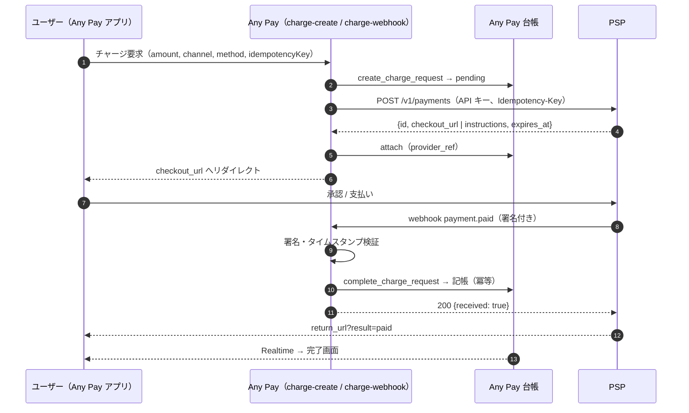
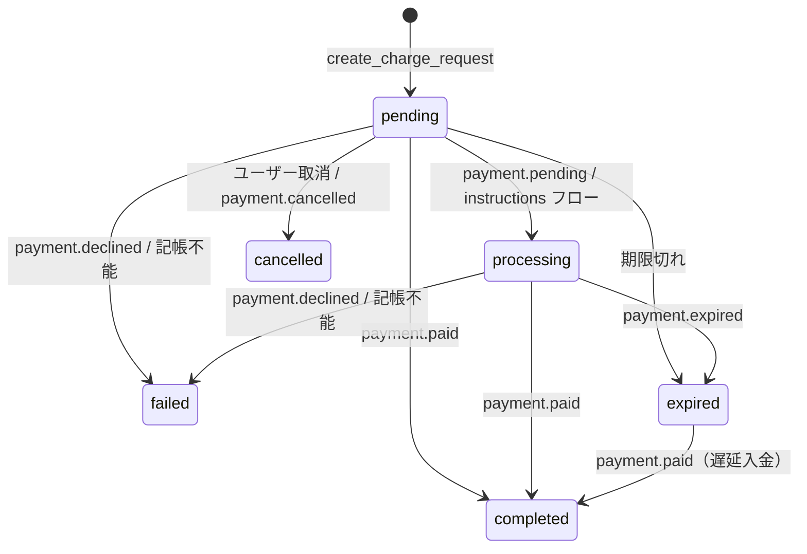

# Any Pay 決済代行向け 連携仕様書（残高チャージ）

対象：クレジット決済・銀行連携（口座振替 / 振込）・その他電子決済（コンビニ払い、電子マネー、ウォレット）で Any Pay の残高チャージを提供する決済代行事業者（PSP）のエンジニア
版：1.0（2026-09）　対応アプリ：Any Pay（ポートフォリオ用デモ。実際のお金は動きません）

---

## 1. 概要

Any Pay の残高チャージは **Charge Gateway** が処理します。Charge Gateway は「入金リクエスト → プロバイダで承認 → 署名付き webhook → 台帳に記帳」の流れを、プロバイダ非依存の形で実装しています。PSP は次の 2 つを提供するだけで接続できます。

1. **支払い作成 API**：Any Pay が金額と戻り先を渡すと、承認画面の URL（または払込番号などの支払い情報）を返す
2. **確定通知（webhook）**：支払いの成否が確定したら、署名を付けて Any Pay に通知する

Any Pay 側の接続コードは「プロバイダアダプタ」（§8）として実装され、同梱の **サンドボックス**（`sandbox-gateway`）が PSP 側 API の参照実装になっています。PSP の API がサンドボックスと同じ契約を満たせば、アダプタはほぼそのまま流用できます。



## 2. 用語とチャネル

| 用語 | 意味 |
|---|---|
| チャネル（`channel`） | `bank`（銀行連携）/ `card`（クレジット）/ `emoney`（その他電子決済） |
| 方式（`method`） | チャネル内の具体的な手段。`bank_debit`（口座振替）、`bank_transfer`（振込）、`card`、`konbini`、`wallet`、`paypay` など。英小文字・数字・`_`、2〜32 文字 |
| フロー（`flow`） | `redirect`（承認画面へ遷移して完了）/ `instructions`（払込番号などを表示し、後で入金） |
| 入金リクエスト | Any Pay 側の `charge_requests` 行。PSP の支払い 1 件と 1 対 1 |
| `provider_ref` | PSP 側の支払い ID |
| `reference` | Any Pay 側の入金リクエスト ID（UUID）。PSP は保存し、webhook で必ず返す |

### チャネル別の要件

| チャネル | 想定フロー | PSP に求めること |
|---|---|---|
| クレジット | `redirect`。カード入力（または保存カード）→ オーソリ + 即時売上（単段階） | 与信否認は `payment.declined`。3D セキュアは PSP 側で完結させる。オーソリのみで保留する場合は `payment.pending`（§5.3）を送ってから確定する |
| 銀行連携（口座振替） | `redirect`。口座選択 + 同意（マンデート）→ 引き落とし | 同意画面での本人確認は PSP 側の責任。引き落とし確定が後日になる場合は `payment.pending` → `payment.paid` |
| 銀行振込 | `instructions`。仮想口座を発行し、入金を待つ | `instructions` に振込先を返し、入金検知で `payment.paid`。期限切れは `payment.expired` |
| コンビニ払い | `instructions`。払込番号を発行し、店頭支払いを待つ | `instructions.payment_code` を返す。有効期限は 24 時間以上を推奨 |
| 電子マネー / ウォレット | `redirect`。ウォレット側の承認 | 残高不足・上限は `payment.declined` |

## 3. 支払い作成 API（PSP が提供）

### 3.1 リクエスト

```
POST {PSP_BASE_URL}/v1/payments
Authorization: Bearer <API キー>
Idempotency-Key: <入金リクエスト ID（UUID）>
Content-Type: application/json
```

```json
{
  "amount": 5000,
  "currency": "jpy",
  "channel": "bank",
  "method": "bank_debit",
  "reference": "6d1f0c4e-3b2a-4d8e-9f10-2a3b4c5d6e7f",
  "return_url": "https://any-pay.pages.dev/charge/pending/6d1f0c4e-…?provider=<provider_id>",
  "webhook_url": "https://<project-ref>.supabase.co/functions/v1/charge-webhook/<provider_id>",
  "locale": "ja"
}
```

| 項目 | 要件 |
|---|---|
| `amount` | 円・整数。1〜100,000（Any Pay 側で検証済み） |
| `currency` | 常に `jpy` |
| `reference` | Any Pay の入金リクエスト ID。**webhook の `data.reference` にそのまま返す** |
| `return_url` | 承認 / 拒否後にユーザーを戻す URL。`result` パラメータを付与して 303 リダイレクトする（§4） |
| `webhook_url` | 確定通知の送り先（プロバイダ ID を含む） |
| `Idempotency-Key` | 同じキーの再送には **同じ支払いを返す**（新規作成しない） |

### 3.2 レスポンス（201）

```json
{
  "id": "sbx_7f3a9c2e1b4d6f8a0c2e4b6d",
  "object": "payment",
  "status": "created",
  "amount": 5000,
  "currency": "jpy",
  "channel": "bank",
  "method": "bank_debit",
  "reference": "6d1f0c4e-3b2a-4d8e-9f10-2a3b4c5d6e7f",
  "checkout_url": "https://psp.example/checkout/sbx_7f3a…",
  "instructions": null,
  "expires_at": "2026-09-09T13:59:00Z"
}
```

| 項目 | 要件 |
|---|---|
| `id` | PSP 側の支払い ID。推測不能な文字列。Any Pay は `provider_ref` として保存 |
| `checkout_url` | `redirect` フローの承認画面。`instructions` フローでは省略可（サンドボックスは端末シミュレーターの URL を返す） |
| `instructions` | `instructions` フローで返す支払い情報。キーは `payment_code`、`store`、`bank_name`、`branch`、`account_number`、`account_holder`、`expires_at` を推奨（Any Pay の画面に表示） |
| `expires_at` | 支払いの有効期限（ISO 8601）。`redirect` は 30 分程度、`instructions` は 24 時間以上を推奨 |

### 3.3 状態取得（任意）

`GET {PSP_BASE_URL}/v1/payments/{id}` — 突合・障害時の再同期に使います。`status` は `created` / `paid` / `declined` / `cancelled` / `expired`。

## 4. 承認画面（PSP がホスト）

- `checkout_url` はユーザーのブラウザで開かれます（PWA の場合は同一タブでの遷移）。モバイル幅（390 px）で操作できるレイアウトにしてください。
- 承認 / 拒否の結果が確定したら、**先に webhook を送信してから** `return_url` にリダイレクトします。順序が逆だと、ユーザーが戻った時点で状態が未確定のまま表示されます（Any Pay 側は Realtime とポーリングで追従しますが、体験が劣化します）。
- リダイレクトは `303 See Other` で、`return_url` に `result` を付与します：`result=paid` / `declined` / `cancelled` / `expired`。`return_url` には既にクエリが付いているため、`&` で連結してください。
- 同じ支払いを 2 回承認できないようにしてください（サンドボックスは `status = created` の行だけを更新する条件付き UPDATE で保証しています）。
- 期限切れの `checkout_url` を開いた場合は「期限切れ」を表示し、`payment.expired` を送信してください。

## 5. 確定通知（webhook。PSP → Any Pay）

### 5.1 リクエスト

```
POST {webhook_url}
Content-Type: application/json
X-Sandbox-Signature: t=1788000000,v1=<hex>
X-Sandbox-Event-Id: evt_…
X-Sandbox-Delivery-Attempt: 1
```

ヘッダ名の `X-Sandbox-*` はサンドボックスの名称です。PSP 固有のヘッダ名（例：`X-<PSP>-Signature`）でも構いません。アダプタ側で読み替えます。

```json
{
  "id": "evt_3c1d…",
  "type": "payment.paid",
  "created": 1788000000,
  "data": {
    "id": "sbx_7f3a9c2e1b4d6f8a0c2e4b6d",
    "status": "paid",
    "amount": 5000,
    "currency": "jpy",
    "channel": "bank",
    "method": "bank_debit",
    "reference": "6d1f0c4e-3b2a-4d8e-9f10-2a3b4c5d6e7f"
  }
}
```

### 5.2 署名

Stripe と同じ方式です。

1. 送信時刻 `t`（UNIX 秒）を決める
2. `signed_payload = t + "." + <リクエスト本文（バイト列そのまま）>`
3. `v1 = HMAC-SHA256(secret, signed_payload)` を 16 進小文字で表す
4. ヘッダ `t=<t>,v1=<v1>` を付ける（鍵ローテーション中は `v1` を複数付けてよい）

Any Pay 側は、`|now - t| ≤ 300 秒` を確認し、同じ計算結果と **定数時間比較**します。本文は署名前に整形（改行・空白の変更、キーの並べ替え）しないでください。

### 5.3 イベント種別

| `type` | 意味 | Any Pay 側の処理 |
|---|---|---|
| `payment.paid` | 入金確定 | 台帳に記帳（`completed`）。ユーザーに通知 |
| `payment.pending` | 受付済み・確定待ち（オーソリのみ、店頭支払い待ち、翌営業日引き落としなど） | `processing` に遷移。記帳しない |
| `payment.declined` | 与信否認・残高不足など | `failed`。ユーザーに通知 |
| `payment.cancelled` | ユーザーまたは PSP による取消 | `cancelled` |
| `payment.expired` | 期限切れ | `expired` |

`payment.paid` は **1 支払いにつき最終的に 1 回以上**送ってください（重複は問題ありません）。`declined` / `cancelled` / `expired` の後に `paid` が来た場合、Any Pay は「失敗・取消の後の入金」として扱い、`failed` / `cancelled` は記帳を拒否（§5.5）、`expired` は記帳します（お金が動いているため）。

### 5.4 応答と再送

| Any Pay の応答 | 意味 | PSP の対処 |
|---|---|---|
| `200 {received: true, results: [...]}` | 受理。`results[].result` が `ok` または `ignored:<コード>` | 完了。`ignored:*` は業務上の拒否（処理済みなど）で、**再送しても変わらない** |
| `400 {error: "INVALID_SIGNATURE"}` | 署名不正 | 鍵と署名計算を確認。再送しない |
| `404 {error: "INVALID_PROVIDER"}` | URL のプロバイダ ID が未登録 | 設定を確認 |
| `500 {error: "TEMPORARY_FAILURE"}` | 一時的な障害 | **指数バックオフで再送**（例：1 分、5 分、30 分、2 時間、24 時間まで。最低 3 回） |
| タイムアウト / 接続不可 | — | 同上 |

再送時は同じ `id`（イベント ID）と本文を使い、`X-…-Delivery-Attempt` を増やしてください。Any Pay は入金リクエスト単位で冪等なので、重複配信で二重計上されることはありません。

### 5.5 Any Pay 側の状態遷移



- 記帳は `completed` への遷移時に 1 回だけ。台帳の冪等キーは `charge_request:<入金リクエスト ID>`。
- 記帳できない場合（ユーザーの残高上限 1,000,000 円を超えるなど）は `failed` + `failure_code = LIMIT_EXCEEDED` になり、200 で受理されます。この場合の資金の扱い（PSP 側での取消 / 返金）は接続時に取り決めます。
- `failed` / `cancelled` の後の `payment.paid` は `ignored:CHARGE_NOT_PENDING` で受理されます。PSP 側で取消 / 返金してください。

## 6. 金額・制限・非機能要件

| 項目 | 値 |
|---|---|
| 通貨・単位 | JPY、整数（小数なし） |
| 1 回のチャージ | 1〜100,000 円 |
| ユーザー残高上限 | 1,000,000 円（記帳時に検査） |
| 同時に持てる未完了リクエスト | ユーザーあたり 5 件 |
| 入金リクエストの既定有効期限 | 30 分（PSP の `expires_at` で上書き） |
| webhook のタイムアウト | Any Pay は 10 秒以内に応答します。PSP 側のタイムアウトは 15 秒以上を推奨 |
| 署名の時刻許容 | ±300 秒（PSP のサーバー時刻は NTP 同期） |
| TLS | 1.2 以上。webhook URL は HTTPS のみ |
| 可用性 | 承認画面・webhook 送信は 99.9% 以上を目安（デモのため SLA はありません） |

## 7. セキュリティ要件

- API キーと webhook 秘密鍵は PSP から Any Pay 運用者へ安全な経路で共有し、Any Pay 側は Edge Functions の secrets に保管します（フロントには置きません）。
- API キーは `Authorization: Bearer` で送ります。PSP 側は定数時間比較で検証してください。
- webhook は署名 + タイムスタンプで検証し、鍵はローテーション可能な設計にしてください（`v1` 複数対応）。
- `reference` / `id` は推測不能な値にし、承認画面 URL から他の支払いを推測できないようにしてください。
- カード番号などの機密情報は Any Pay に送らないでください。Any Pay は `provider_ref` と結果のみを保存します。
- PCI DSS、本人確認（KYC）、不正検知、チャージバック対応は PSP 側の責任範囲です。

## 8. Any Pay 側アダプタ（参考）

PSP 固有の API 形式に合わせて、Any Pay 側では次のインターフェースを実装します（TypeScript / Deno）。サンドボックス実装 `supabase/functions/_shared/gateway/providers/sandbox.ts` と Stripe 実装 `stripe.ts` がひな形です。

```ts
export interface ChargeProvider {
  readonly id: string;                      // 'sandbox' | 'stripe' | '<psp>'
  methods(): MethodSpec[];                  // { provider, method, channel, flow }
  createPayment(input: CreatePaymentInput): Promise<CreatePaymentResult>;
  parseWebhook(req: Request, rawBody: string): Promise<ProviderEvent[]>;
}
// CreatePaymentInput  : requestId, userId, amount, channel, method, returnUrl, webhookUrl, locale
// CreatePaymentResult : providerRef, redirectUrl?, instructions?, status?('pending'|'processing'), expiresAt?
// ProviderEvent       : requestId, providerRef, kind('completed'|'processing'|'failed'|'cancelled'|'expired'), code?, payload
```

`registry.ts` に登録し、secrets（API キー・webhook 秘密鍵）を追加すると、`charge-methods` の一覧に PSP の方式が現れ、アプリのチャージ画面に自動で表示されます。

## 9. 接続テスト（サンドボックスを使った受け入れ基準）

PSP 側 API の実装前に、サンドボックスで Any Pay 側の挙動を確認できます。`GET https://<project-ref>.supabase.co/functions/v1/sandbox-gateway` で API 仕様が返ります。

| # | シナリオ | 期待結果 |
|---|---|---|
| 1 | 口座振替を承認 | `payment.paid` → 入金リクエスト `completed`、取引 1 件、ユーザーに通知 |
| 2 | カードを拒否 | `payment.declined` → `failed`、残高不変、通知 |
| 3 | コンビニ払込番号を発行 → 支払い | `instructions` 表示 → `processing` → `payment.paid` → `completed` |
| 4 | webhook を再送（結果画面「通知を再送する」） | `200 ignored:*` または `ok`、取引は増えない |
| 5 | 署名を改ざん | `400 INVALID_SIGNATURE` |
| 6 | タイムスタンプを 10 分ずらす | `400 INVALID_SIGNATURE` |
| 7 | 支払い作成 API を同じ `Idempotency-Key` で 2 回 | 同じ支払い ID |
| 8 | ユーザーが承認前にキャンセル → その後承認 | `ignored:CHARGE_NOT_PENDING`、記帳なし |
| 9 | 残高が上限直前のユーザーで承認 | `failed` / `LIMIT_EXCEEDED`、残高不変 |

自動テスト用に `POST /v1/payments/{id}/simulate {"outcome": "paid" | "declined"}` があります（API キー必須）。

## 10. 接続手順

1. PSP から Any Pay 運用者へ：ベース URL、API キー、webhook 秘密鍵、対応チャネル / 方式、テスト用の承認画面。
2. Any Pay 側：アダプタ実装 → secrets 登録 → デプロイ（Actions が自動）。
3. PSP 側：webhook 送信先 `https://<project-ref>.supabase.co/functions/v1/charge-webhook/<provider_id>` を登録。
4. §9 の受け入れ基準を双方で実施。
5. 本番相当（デモ）環境で有効化。アプリのチャージ画面に方式が表示されます。

## 11. 変更履歴

| 版 | 日付 | 内容 |
|---|---|---|
| 1.0 | 2026-09 | 初版（サンドボックス / Stripe テストモードに基づく） |
